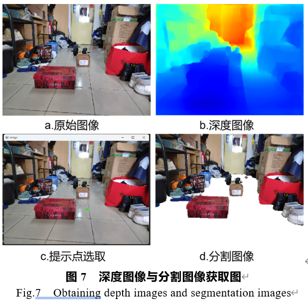

### Ground Segmentation based Monocular depth estimation 基于图像地面分割处理的单目深度估计
The python code is provided for ground-segmentation based monocular depth estimation.
``src`` file is the python source file.

#### simulation

